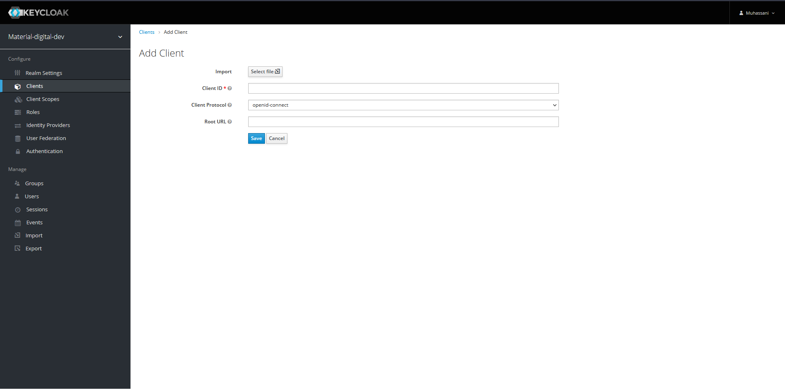

Pyiron
===
{: no_toc}

## Table of Contents
{: no_toc}

- TOC
{:toc}  

## Description

[pyiron](https://pyiron.org) is an integrated development environment (IDE) for computational materials science. It integrates several computational/analysis tools in a common platform and provides various functionalities for creation, management and sharing of your workflows. 

## Setup

### Requirements 

In order to run pyiron, prepare for the following  hardware-requirements:
- for running jupyterhub: > 2 GB of RAM, 2 VCPU
- overall resources on the server should be proportional to the number of users:
  ~2 GB of RAM, 2 VCPU, 10 GB of storage per user

Morever, we assume the following:

- This setup uses Keycloak as identity provider. Therefore, a client id and secret are needed.
- For simplicity, we assume that all jobs are run on the same server as the
  jupyterhub container.
- The configuration of the hostnames is assumed to be done separately by the admin, e.g. creating the A-record, etc


###  1. Clone the Repository

Clone this [GitHub
repository](https://github.com/materialdigital/pyiron_workflow_environment_deployment)
into your pmd-server's root directory:

``` 
git clone https://github.com/materialdigital/pyiron_workflow_environment_deployment pyiron
```

Just to give you a brief overview what's in there:


| File | Description |
| ----------------- | ----------- |
| `config.json` | a json file containing the configurable environment variables: keycloak client details, name of pyiron docker images, users' resources, and Postgres database Password |  
| `static.json` | a json file containing the non-configurable environment variables |  
| `nginx/pyiron.conf` | A template of the configuration file for the Nginx reverse proxy |  
| `docker-compose.yml` | the compose file, which runs jupyterhub and its Postgres database services. |  


### 2. Configure Nginx
For the Nginx reverse proxy, you need to provide a configuration file. A template is provided in the repository under `repo_path/nginx/pyiron.conf`  
After adding the domain, and the path to the SSL certificates and key (as described [here](../core/reverse_proxy.md)), you should copy it to the nginx directory:
```bash
cp nginx/pyiron.conf ../data/nginx/
```
Of course, here it is assumed that the PMD-S core repo is the parent directory of the pyiron deployment directory.

### 3. Obtaining SSO credentials
You can obtain SSO credentials to connect to the [MaterialDigital SSO]((https://sso.material-digital.de) ) (A)
or use [your own Keycloak instance](../core/keycloak.md) (B) as identity provider (IDP)

#### (A) sso.material-digital.de as IDP (recommended)
Submit a request for pyiron SSO credentials via the [Material Digital contact form](https://www.material-digital.de/contact/). 
In the form provide the URL you have reserved for your pyiron instance.

#### (B) local SSO
If you choose to use a [local Keycloak instance](../core/keycloak.md), you can create a
keycloak-client via the following steps:

1) Sign in as the admin of the keycloak instance  
2) Select your desirable realm  
3) Select clients from the left panel  
4) On the top right-hand side, select create  
5) Enter a client ID, and a root URL. For the URL, you should provide the url of pyiron  
     
6) click save    
7) In the setting tab, change the access type to confidential, and save  
8) From the credential tab, you can obtain the client secret  

### 4. Select  Pyiron Docker Images

In the next step, You need to customize the central configuration file
`config.json`.  There, you will need to provide tag-names for a set of pyiron
docker images you can choose from when starting a session.
Pyiron offers various docker images corresponding to its modules: atomistics,
continuum, md, etc.

The docker images are available on docker hub:
[https://hub.docker.com/u/pyiron](https://hub.docker.com/u/pyiron), and the
corresponding dockerfiles can also be found via
[https://github.com/pyiron/docker-stacks](https://github.com/pyiron/docker-stacks).


### 5. Adapt `config.json` and Generate Files for Docker-Compose.

Edit `config.json` to reflect your environment: be sure to replace the
placeholders `<keycloak_domain>` and `<pyiron_domain>` in the URLs with the
correct destination for the keycloak-instace (either local or shared across
PMD-participants) and for the pyiron-service at hand.

Moreover, you need the keycloak-realm (placeholder `<realm>`, the client id, and
the client secret (see Step 3. if you chose to configure keycloak by yourself).

Also, do not forget to choose eligible image-tags for base, atomistic, continuum
and experimental (see Step 4).

The details of the keys in `config.json` can be found in the table below.

| key | definition |
|-----|------------|
| `OAUTH2_TOKEN_URL` | Keycloak Token URL; here you need only to change the domain and the realm"
| `OAUTH2_AUTHORIZE_URL` | Keycloak authorize URL; here you need only to change the domain and the realm |
| `OAUTH2_USERDATA_URL` | Keycloak userdate URL; here you need only to change the domain and the realm |
| `OAUTH_CALLBACK_URL` | Keycloak call back URL; here you need only to change the domain|
| `CLIENT_ID` | The client ID defined in Keycloak |
| `CLIENT_SECRET` | The secret for the client, provided from the Keycloak instance|
| `PYIRON_BASE` | The relevant information of pyiron_base image in the form of `image_name:tag, e.g. pyiron/base:2021-06-04` |
| `PYIRON_ATOMISTIC` | The relevant information of pyiron_atomistics image in the form of `image_name:tag, e.g. pyiron/pyiron:2021-06-04` |
| `PYIRON_CONTINUUM` |  The relevant information of pyiron_continuum image in the form of `image_name:tag, e.g. pyiron/continuum:2021-06-04` |
| `PYIRON_EXPERIMENTAL` | The relevant information of pyiron_experimental image in the form of `image_name:tag, e.g. pyiron/experimental:2021-06-04` |
| `MEM_LIMIT` | The limiting amount of RAM per user |
| `CPU_LIMIT` | The limiting amount of VCPU per user |
| `ADMIN_USER` | The username of jupyterhub admin, this username should be consistent with the username in the keycloak instance |
| `POSTGRES_PASSWORD` | A password for the postgres database |


### 6. Generate the env-files
To generate the environment files, run the `configure.py` script from the parent directory. The script can also be found [here](https://github.com/materialdigital/pmd-server/blob/main/scripts/configure.py)
```
cd pyiron
# run `configure.py` script from the pmd-server parent directory
# in the case that python3 is installed on the host OS:
python3 ../scripts/configure.py
# otherwise you can use a docker container to run the script via: 
docker run --rm -v $PWD/:/tmp/ -v $PWD/../scripts/configure.py:/tmp/configure.py-w /tmp  python:3-alpine  python configure.py   
```

### 7. Run docker-compose
Run the compose-script to start the containers via:
```
docker-compose up -d 
```


## HPC connection (will be added soon)  
In principal, the pyiron docker containers can submit jobs to the cluster according to pyiron documentation in [here](https://pyiron.readthedocs.io/en/latest/source/installation.html#submit-to-remote-hpc).
This feature will be added to pyiron docker images in the next release.

## Room for modification
Here we assumed a semi-automated deployment with minimal changes needed from the side of IT administrators. However, many things can be changed, such as:
- building a customized jupyterhub; this gives the possibility to change the jupyterhub configuration
- In the current setup, we assumed to have four jupyter environments based on: `pyiron_base`, `pyiron_atomistics`, and `pyiron_continuum`, `pyiron_experimental`. This list can be extended in the case of a customized jupyterhub build.


###### tags: `PMD Deployment guide`
{: .no_toc }
